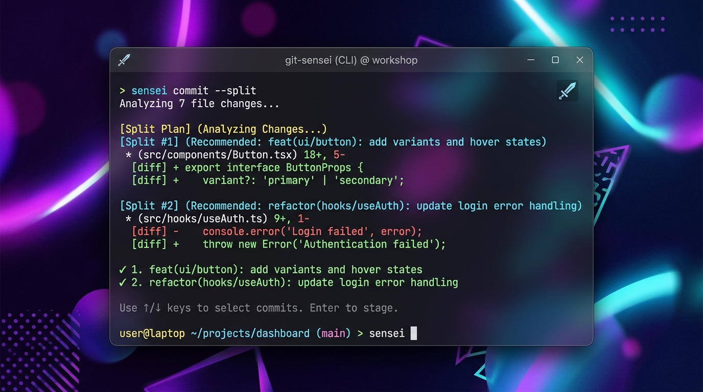

# Git-Sensei

[](https://github.com/Lukasz-Szymanski/git_sensei/actions/workflows/ci.yml)



> **Smart Context. Universal AI Adapter. Professional Commits.**

A CLI tool that generates professional commit messages using any AI provider (Gemini, Claude Code, OpenAI, Ollama).

## Features

- **Universal Providers** - Switch between Gemini, Claude Code, OpenAI, or local LLMs with one command
- **Secrets Shield** - Scans diffs for API keys, tokens, passwords before sending to AI
- **Smart Context** - Auto-links commits to issue IDs from branch names (Jira, GitHub, GitLab, Linear, Azure DevOps)
- **Branch Type Detection** - Auto-detects commit type from branch prefix (`feature/` → feat, `fix/` → fix)
- **Conventional Commits** - Generates properly formatted commit messages
- **Offline Fallback** - Heuristic engine works when AI is unavailable
- **Interactive Review** - Edit, retry, or approve before committing
- **Editor Integration** - Edit commit messages in your preferred IDE (VS Code, PyCharm, etc.)

## Installation

```bash
pip install git-sensei-ai
```

## Requirements

- **Python 3.9+**
- **Git**
- **One of the AI CLI tools:**

| Provider    | Installation                               |
| ----------- | ------------------------------------------ |
| Gemini      | `npm install -g @google/gemini-cli`        |
| Claude Code | `npm install -g @anthropic-ai/claude-code` |
| OpenAI      | `pip install chatgpt-cli`                  |
| Ollama      | [ollama.ai](https://ollama.ai)             |

## Quick Start

```bash
sensei init      # First time setup (choose AI provider)
git add .        # Stage your changes
sensei commit    # Generate commit with AI
```

## Git Hooks & Pre-commit

### 1. Traditional Git Hook
You can install a native Git hook in your local repository to automatically generate commit messages whenever you run `git commit` (without having to type `sensei commit` manually):

```bash
sensei install-hook
```

### 2. Pre-commit Framework Integration
To enforce Conventional Commits formatting across your team, you can use Git-Sensei as a linter inside the [pre-commit](https://pre-commit.com/) framework.

Add the following to your project's `.pre-commit-config.yaml`:

```yaml
repos:
  - repo: https://github.com/Lukasz-Szymanski/git_sensei
    rev: v0.14.0  # Use the latest release version tag
    hooks:
      - id: git-sensei-lint
```

Then install the hook with:
```bash
pre-commit install --hook-type commit-msg
```
This hook will automatically validate all commit messages during the `commit-msg` git stage.

### First Time Setup

```
$ sensei init
Welcome to Git-Sensei!

Select your AI provider:

  1. Google Gemini (npm i -g @google/gemini-cli)
  2. Claude Code (npm i -g @anthropic-ai/claude-code)
  3. OpenAI GPT-4 (pip install chatgpt-cli)
  4. Ollama (https://ollama.ai)

Select provider [1]: 2

Selected: Claude Code
Testing connection... OK

Config saved to ~/.sensei.toml
Default provider: claude

Ready! Run: git add . && sensei commit
```

The wizard will:
- Detect existing configuration and ask before overwriting
- Test the connection with a real AI request
- Show installation instructions if the provider is not found

## Commands

| Command                   | Description                            |
| ------------------------- | -------------------------------------- |
| `sensei init`             | Interactive setup wizard (with connection test) |
| `sensei commit`           | Generate and create a commit           |
| `sensei amend`            | Rewrite the last commit message using AI |
| `sensei commit -p claude` | Use specific provider                  |
| `sensei commit -d`        | Dry run (preview only)                 |
| `sensei commit --emoji`   | Generate commit with Gitmoji prefix    |
| `sensei use <provider>`   | Set default AI provider                |
| `sensei ls`               | List available providers               |
| `sensei check [provider]` | Verify provider is working             |
| `sensei install-hook`     | Install as git `prepare-commit-msg` hook |

### Examples

```bash
sensei commit                 # Use default provider (Antigravity CLI)
sensei amend                  # Rewrite last commit message
sensei commit -p gemini-api   # Use Native Gemini API (requires GEMINI_API_KEY)
sensei commit --emoji         # Generate with emojis (e.g. ✨ feat: add login)
sensei commit -d              # Preview without committing
sensei use gemini-api         # Set Gemini API as default
sensei ls                     # List providers (* = default)
sensei check                  # Check default provider
sensei install-hook           # Set up standard git hook
```

## Configuration

Sensei loads configuration from (in order of priority):

1. `~/.sensei.toml` (user config - highest priority)
2. `./.sensei.toml` (project config)
3. Package defaults

### Example `.sensei.toml`

```toml
[core]
default_provider = "claude"

[providers.claude]
description = "Claude Code CLI"
command = "claude --print \"{system}\""
prompt = """OUTPUT ONLY THE COMMIT MESSAGE. NO EXPLANATIONS.

Format: type(scope): summary

- bullet points for details

Types: feat, fix, docs, refactor, chore
Start DIRECTLY with type."""
```

- `{system}` - replaced with the prompt
- `prompt` - custom prompt per provider (optional)
- Git diff is piped to stdin

### Custom OpenAI-Compatible & Local LLM (Ollama) Setup

You can configure Git-Sensei to use local models running via Ollama or custom OpenAI-compatible endpoints (like DeepSeek, Groq, OpenRouter) natively or via CLI.

Add the following to your `~/.sensei.toml`:

#### Option A: Local Ollama via Native HTTP API (Recommended)
This uses Ollama's built-in OpenAI-compatible endpoint. No API key is required.

```toml
[providers.ollama_api]
description = "Local Llama 3 via Ollama API"
api_url = "http://localhost:11434/v1/chat/completions"
model = "llama3"
```

#### Option B: Local Ollama via CLI Command
This pipes the diff directly into the `ollama` command line tool.

```toml
[providers.ollama_cli]
description = "Local Llama 3 via CLI"
command = "ollama run llama3 \"{system}\""
```

#### Option C: Custom OpenAI-Compatible API (e.g. DeepSeek)
You can point to any external API and map its API key to a custom environment variable.

```toml
[providers.deepseek]
description = "DeepSeek Coder API"
api_url = "https://api.deepseek.com/v1/chat/completions"
api_key_env = "DEEPSEEK_API_KEY"
model = "deepseek-coder"
```

### Tuning Prompts

Use dry run to test your prompt without committing:

```bash
sensei commit -d          # Preview generated message
# Edit .sensei.toml prompt if needed
sensei commit -d          # Test again
sensei commit             # Commit when satisfied
```

Each AI model may need different prompting style. Adjust per provider in config.

## Interactive Workflow

After generating a message, you'll see:

```
Context: Type: feat; Closes issue #42
--------------------------------------------------
feat(auth): add user login endpoint

Implement JWT-based authentication with secure token handling.

- Add login endpoint with email/password validation
- Implement JWT token generation and verification
- Add middleware for protected routes

Closes #42
--------------------------------------------------
Action? [y]es, [n]o, [e]dit, [r]etry
```

- **y** - Commit with this message
- **n** - Abort
- **e** - Edit in external editor (VS Code, PyCharm, etc.)
- **r** - Regenerate with AI

### Smart Context Detection

Sensei automatically detects context from your branch name:

| Branch Name | Detected Context |
|-------------|------------------|
| `feature/42-add-login` | Type: feat, Closes #42 |
| `fix/123-crash-bug` | Type: fix, Closes #123 |
| `hotfix/PROJ-456-security` | Type: hotfix, Refs: PROJ-456 |
| `refactor/cleanup` | Type: refactor |

This context is passed to the AI for better commit messages.

### Editor Integration

When you press `[e]dit`, Sensei opens the commit message in your configured editor.

**Setup your editor (one-time):**

```bash
# VS Code
git config --global core.editor "code --wait"

# PyCharm
git config --global core.editor "pycharm --wait"

# Cursor
git config --global core.editor "cursor --wait"

# Vim
git config --global core.editor "vim"
```

Sensei uses this priority to find your editor:
1. `$VISUAL` environment variable
2. `$EDITOR` environment variable
3. `git config core.editor`
4. Platform default (notepad on Windows, nano on Linux/Mac)

## CLI Commands & Diagnostics

Sensei provides several diagnostic and helper commands to ensure quality and track your AI usage.

<details>
<summary><b>📊 sensei stats</b> (Track usage statistics)</summary>

Displays local commit generation statistics, acceptance rate, model breakdown, and most common commit types.

```bash
$ sensei stats
Git-Sensei Statistics
──────────────────────
Commits generated:  42
Acceptance rate:    88% (37 accepted, 5 rejected)
Provider usage:     gemini-api (76%), openai (24%)
Most common type:   feat (52%), fix (30%), refactor (10%)
Average msg length: 145 chars
```

Use `sensei stats --json` to export raw JSON, or `sensei stats --reset` to clear local stats.
</details>

<details>
<summary><b>📜 sensei log</b> (Colored git history & validation)</summary>

Displays recent commits with Conventional Commits color-coding and format validation markers (`✓` for valid, `✗` for invalid).

```bash
$ sensei log -n 5
* 79c5291 chore: remove PROJECT.md tracking and add to ignore  ✓
* fef09a0 chore: ignore .agents directory in gitignore  ✓
* f5838f7 feat(custom-api): implement custom API support and secret redaction  ✓
* bf4f1ef feat(split): implement atomic diff splitting  ✓
* 3a104f2 docs: update documentation with invalid markdown `formatting`  ✗
```

Use `sensei log --stats` to print a Conventional Commits compliance summary at the end.
</details>

<details>
<summary><b>🔍 sensei lint</b> (Commit message validation)</summary>

Validates a commit message against Conventional Commits formatting rules, line lengths (max 72 chars), and checks for disallowed markdown styles (like backticks or bold text).

```bash
$ sensei lint "feat(auth): add google sign-in option"
✓ Commit message is valid.

$ sensei lint "feat: update `README` file with markdown"
✗ Commit message validation failed:
  - First line contains disallowed markdown formatting (backticks, bold, italic).
```
</details>


## Project Structure

```
git_sensei/
├── main.py           # CLI entrypoint
├── config.py         # Configuration loader
├── providers.py      # AI provider adapter
├── local_bridge.py   # Offline fallback engine
├── .sensei.toml      # Default configuration
├── tests/            # Unit tests
└── docs/             # Documentation
```

## Changelog

<details>
<summary>Version history</summary>

### v0.14.0 (2026-07-03)

- Added custom prompt configuration (languages, style overrides, file templates) and few-shot log history injection (Milestone 1)
- Added smart diff truncation and file filtering (lockfiles, binaries, minified assets) supporting smart/head/tail/sample strategies (Milestone 2)
- Added automatic scope detection for monorepos based on directory structures and custom path globs (Milestone 3)
- Added interactive refinement loop (re[f]ine) to direct/regenerate message and interactive commit type/emoji selector ([s]elect) (Milestone 4)
- Added atomic commit splitter (`sensei commit --split`) to group large changes into separate, logical commits (Milestone 5)
- Added support for custom OpenAI-compatible API endpoints (e.g. DeepSeek, Ollama) and automatic secret redaction with [REDACTED] in diffs (Milestone 6)
- Added CLI diagnostics (`sensei stats`, `sensei log`, `sensei lint`) and integration configuration for pre-commit frameworks (Milestone 7)
- Added `sensei amend` command to rewrite the last commit message with AI analysis
- Added safety checks to prevent accidental rewrites of pushed commits without warning
- Enhanced Smart Context with expanded issue ID patterns (e.g., `gh-123`, `ado-123`) and auto-uppercasing

### v0.13.0 (2026-07-01)

- Enhanced Secrets Shield with configurable behavior (`block`, `warn`, `ignore`)
- Added support for custom secret regex patterns via `custom_patterns` configuration

### v0.12.0 (2026-01-03)

- External editor integration for `[e]dit` option (VS Code, PyCharm, Cursor, etc.)
- Fallback chain for editor detection: $VISUAL → $EDITOR → git config → platform default

### v0.11.1 (2026-01-03)

- Smart Context Detection - auto-detects branch type (feature/ → feat, fix/ → fix)
- Universal prompt for all AI providers - consistent, detailed commit messages
- Context info displayed before generating (Type, Issue ID, branch status)
- Improved issue ID detection from branch names (feature/1-description → #1)

### v0.11.0 (2026-01-03)

- Enhanced `sensei init` wizard with real connection testing
- Detects existing config and asks before overwriting
- Shows installation instructions when provider is not found

### v0.10.0 (2025-12-30)

- Extended Smart Context to support GitHub (#123), GitLab, Linear, Azure DevOps, Shortcut
- Custom prompts per provider in .sensei.toml
- Improved default prompt for cleaner AI output

### v0.9.0 (2025-12-30)

- Added Secrets Shield - detects API keys, tokens, passwords in diffs
- Warns before sending sensitive data to AI provider

### v0.8.0 (2025-12-30)

- Added `sensei init` interactive setup wizard
- Improved CLI help messages with examples

### v0.7.0 (2025-12-30)

- Added `sensei use <provider>` command
- User config now takes priority over project config
- Added Claude Code CLI support

### v0.6.0 (2025-12-18)

- Windows support for `.cmd` and `.bat` tools
- Enforced `sensei commit` as primary command

### v0.5.0 (2025-12-18)

- Universal AI Adapter - works with any CLI tool
- Added `.sensei.toml` configuration
- Added `sensei check` and `sensei ls` commands

### v0.4.0 (2025-12-18)

- Smart Context - auto-detect issue IDs from branch names

### v0.3.0 (2025-12-18)

- Inline message editing

### v0.2.0 (2025-12-17)

- Gemini CLI integration

### v0.1.0 (2025-12-09)

- Initial release with heuristic engine

</details>

## License

MIT
